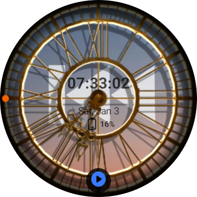
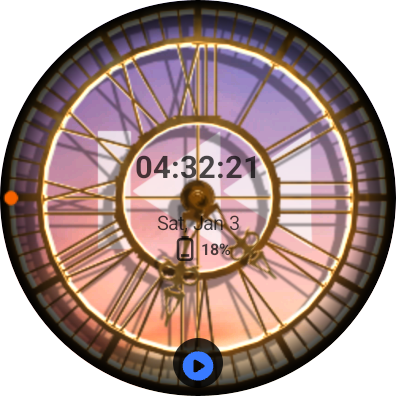
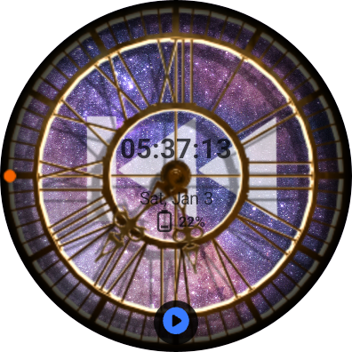
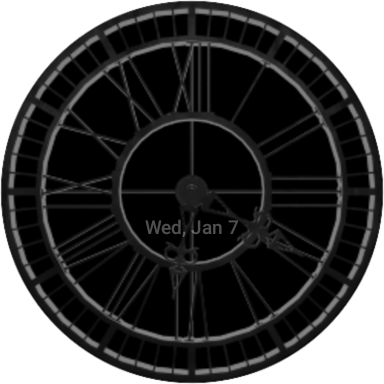

# ⌚ RewindWatch - Dynamic Wear OS Watch Face


> **A highly interactive Wear OS watch face featuring 2.5D parallax effects, real-time weather backgrounds, and performance-optimized rendering.**

## 📱 Screenshots

**Time Changes (Interactive Mode)**

| Dawn | Day | Sunset | Night |
|:---:|:---:|:---:|:---:|
|  |  |  |  |

**Features**

| Parallax Effect | Configuration | AOD Mode |
|:---:|:---:|:---:|
|  |  |  |

## ✨ Key Features

* **2.5D Parallax Effect:** Creates a depth effect by moving background layers and 3D-modeled indices based on **Gyroscope sensor** data.
* **Dynamic Weather Backgrounds:** Automatically changes the background (Clear, Rain, Snow, Dawn, Sunset, Night) based on **OpenWeatherMap API** data and local time.
* **Custom 3D Assets:** High-quality watch hands and indices modeled directly in **Blender**.
* **User Customization:** Toggle visibility for Time, Date, and Battery via a custom **Configuration Activity**.
* **Always-On Display (AOD):** Supports low-power ambient mode with burn-in protection logic.

## 🛠 Tech Stack

* **Language:** Kotlin
* **Platform:** Android Wear OS
* **Architecture:** Android Watch Face Service
* **Libraries:**
    * `androidx.wear.watchface`
    * `kotlinx.coroutines` (For asynchronous tasks)
    * `com.google.android.gms:play-services-location`
* **Tools:** Android Studio, Blender (Asset Design)

## 🚀 Technical Highlights & Performance Optimization

### 1. Solving ANR (Application Not Responding)
**Issue:** Initial versions suffered from UI freezing and ANR crashes due to heavy bitmap decoding and resizing operations running on the Main Thread during the `render()` loop.

**Solution:**
* **Asynchronous Loading:** Migrated weather API calls and heavy bitmap resource decoding to the **IO Thread** using `Kotlin Coroutines`.
* **Render Loop Optimization:** Refactored `updateLayoutAndScale()` to prevent redundant calculations. The heavy layout logic now triggers **only when the screen bounds actually change**, reducing CPU usage from ~99% to <5% during idle states.

### 2. Memory Management
**Issue:** Frequent garbage collection (GC) caused frame drops (jank) due to creating new `Paint` and `Bitmap` objects in the `onDraw` method.

**Solution:**
* Pre-allocated all `Paint` and `Bitmap` objects during initialization.
* Implemented a reuse strategy for scaled bitmaps to minimize memory churn.

## 📂 Project Structure

```
RewindWatch/
├── app/
│   ├── src/main/
│   │   ├── AndroidManifest.xml       # App permissions, Service & Activity declarations
│   │   ├── java/com/example/rewindwatch/
│   │   │   ├── presentation/
│   │   │   │   ├── MainActivity.kt   # Configuration Activity (Watch Face Editor)
│   │   │   │   └── MyWatchFace.kt    # Core Logic (Rendering, Sensor, Weather API, Coroutines)
│   │   │   └── theme/
│   │   └── res/
│   │       ├── drawable/             # 3D Assets (Watch Hands, Indices) & Dynamic Backgrounds
│   │       ├── values/strings.xml
│   │       └── xml/watch_face.xml    # Watch Face Metadata
│   └── build.gradle.kts
├── gradle/libs.versions.toml         # Centralized dependency versions
├── build.gradle.kts                  # Root-level build configuration
├── settings.gradle.kts
├── local.properties                  # API keys (Not pushed to Git)
└── README.md
```

## 👩‍💻 Author

**Sehee Hwang**
* **Role:** Lead Developer & 3D Designer
* **Contact:** hsehee@udel.edu

---
*© 2026 RewindWatch. All rights reserved.*
