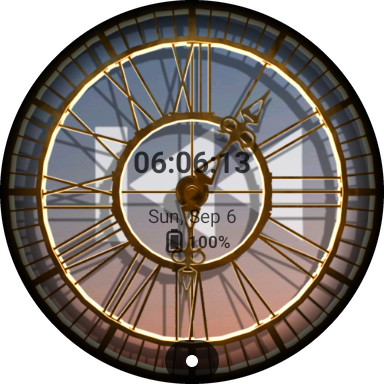
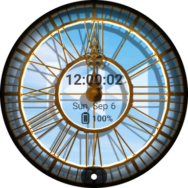
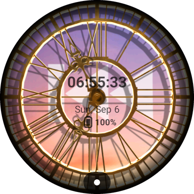
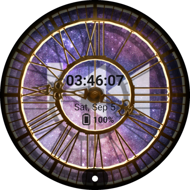
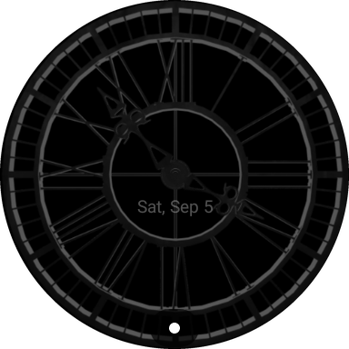

# ⌚ RewindWatch - Dynamic Wear OS Watch Face


> **A highly interactive Wear OS watch face featuring 2.5D parallax effects, real-time weather backgrounds, and performance-optimized rendering.**

Current release: **v2.0.4** (versionCode 8).

## 📱 Screenshots

**Time Changes (Interactive Mode)**

| Dawn | Day | Sunset | Night |
|:---:|:---:|:---:|:---:|
|  |  |  |  |

**Features**

| Parallax Effect | Configuration | AOD Mode |
|:---:|:---:|:---:|
|  |  |  |

## ✨ Key Features

* **2.5D Parallax Effect:** Sky, logo and frame shadow move at different depths as the wrist tilts, driven by the **accelerometer** (50 Hz sampling, redraws capped at ~30 fps and only when the tilt actually changes).
* **Dynamic Sky:** Dawn / Day / Sunset / Night backgrounds follow the real **sunrise and sunset** for the wearer's location, with asymmetric transition windows that match how the sky is perceived.
* **Weather Animations:** Rain and snow overlays (19 / 20 frames at 180 ms) driven by **OpenWeatherMap** data for the wearer's coarse location.
* **Custom 3D Assets:** Watch hands, indices and centre caps modeled in **Blender**; hand shadows rotate with the hand so the viewer reads as the light source.
* **User Customization:** Toggle Time, Date, Battery and the weather animation; pick font style and weight in the on-watch **Configuration Activity**, with a highlight overlay that points at the element being edited.
* **Always-On Display (AOD):** Grayscale ambient mode at reduced brightness with a 4-minute 1 px pixel-shift cycle for OLED burn-in defense.
* **Bilingual UI:** Korean / English, selected by the watch's system locale.
* **Permission Flow:** Tapping the app in the launcher opens a status screen that requests coarse location; denied or not, the face keeps working (falls back to Seoul weather).

## 🛠 Tech Stack

* **Language:** Kotlin
* **Platform:** Wear OS (minSdk 30, targetSdk 34)
* **Architecture:** `androidx.wear.watchface` (`WatchFaceService` + `CanvasRenderer2`), Compose editor via `EditorSession`
* **Libraries:**
    * `androidx.wear.watchface` / `watchface-editor` / `watchface-style`
    * `kotlinx.coroutines` (asynchronous decoding and network)
    * `com.google.android.gms:play-services-location` (fused coarse location)
    * JUnit 4 (unit tests for the sky-phase logic)
* **Build:** R8 minification + resource shrinking for release
* **Tools:** Android Studio, Blender (asset design)

## 🚀 Technical Highlights & Performance Optimization

### 1. Solving ANR (Application Not Responding)
**Issue:** Early versions froze and crashed with ANRs because heavy bitmap decoding and resizing ran on the main thread inside the `render()` loop.

**Solution:**
* Weather calls and bitmap decoding moved to the **IO dispatcher** with coroutines.
* `updateLayoutAndScale()` only runs its heavy path when the **screen bounds actually change**, cutting idle CPU from ~99% to under 5%.
* The hands / frame / logo are still guaranteed before the very first frame: the system snapshots a headless instance right after creation for the favourites thumbnail, so a frame drawn before those assets exist would be cached as the face's preview.

### 2. Memory Management
**Issue:** Frame drops from GC churn (new `Paint` / `Bitmap` objects every draw) and a 161 MB native heap on the watch.

**Solution:**
* All `Paint` and `Bitmap` objects are pre-allocated; scaled bitmaps are reused.
* Bitmaps live in **`res/drawable-nodpi/`**. In `res/drawable/` a 320 dpi watch decoded every asset at 2x; moving them dropped the native heap from 161 MB to 38 MB with rain showing.
* Skies are cached per screen size: the current phase is decoded before the first frame, the other three are warmed on IO, and a phase change is a map lookup on the UI thread. Headless thumbnail instances decode a single sky and never load the weather frame set.
* `onDestroy` publishes a `destroyed` flag first and takes each lock only briefly; a decode that is still running recycles its own result instead of leaking it, so teardown no longer stalls the main thread.

### 3. Display Quality
**Issue:** Indices and bezel looked blurry / zoomed on first launch and after returning from the editor; backgrounds were stretched into a non-square aspect, giving inconsistent parallax framing.

**Solution:**
* No `inSampleSize` on the fixed-size 500x500 index / hand assets, so they load at full resolution.
* **Unscaled originals in `*Src` fields**, resampled from the original on every bounds change, so scale loss never compounds.
* Skies ship as **pre-cropped 1260 px squares** and are centre-cropped to a deterministic square, so parallax offsets are consistent every time.

### 4. Battery & Burn-in Defense
**Issue:** Interactive mode redrew at 60 fps regardless of motion; the accelerometer stayed registered on **headless instances** (picker / favourites thumbnails), so a leaked listener ran ~17 h overnight and drained ~80% in 12 h. In AOD the same pixels stayed lit for hours.

**Solution:**
* Baseline interactive tick is **1 s**, rising to the **180 ms frame rate only while rain or snow is actually showing**.
* The sensor is registered only when the instance is **not headless, visible, interactive and in interactive draw mode**, and unregistered the moment any of those changes.
* Sensor events trigger `invalidate()` only when the smoothed tilt moves by more than 0.05 and at most every 33 ms.
* AOD renders grayscale at reduced brightness with a **4-minute pixel-shift cycle** (1 px on a `(0,0) → (1,0) → (1,1) → (0,1)` pattern).

### 5. Weather Fetch Robustness
**Issue:** Failures were silent, the sunrise / sunset fallback was relative to "now", and a `delay()`-based 30-minute loop stalls while the watch sleeps, so a face coming back on screen could show hours-old weather or the wrong sky.

**Solution:**
* `Log.w` / `Log.e` on every failure path (HTTP non-200, exceptions, missing API key, permission denied); diagnosable with `adb logcat -s RewindWatch:*`.
* **60-second retry** after a failed fetch, a **30-minute** refresh loop that skips while the face is not visible, and a **staleness check on every wrist raise / return to the screen** (refetch if the last successful response is over 30 min old, spaced at least 5 min apart so an offline watch doesn't hammer the network).
* Every fetch carries a **generation number**; a slow or retried response is discarded if a newer fetch has started, so the Seoul fallback can never overwrite a real-location result that followed a permission grant.
* Timestamps use `elapsedRealtime`, so a wall-clock correction cannot make stale data look fresh.
* Sunrise / sunset are **projected onto the current day**, so a schedule from an earlier day still classifies today correctly instead of reading as NIGHT once its own sunset has passed. Fallback anchors to today's 06:00 / 18:00 in the system zone.
* Asymmetric **DAWN (-30 / +15 min)** and **SUNSET (-45 / +20 min)** windows, pinned by unit tests including multi-day rollover.
* Location is **coarse only** (~11 km) and logged at 0.1 degree resolution; weather is city-scale data, so fine location was never needed.

### 6. APK Size
**Issue:** The first v2 release APK was 56 MB.

**Solution (56 MB → ~12 MB):**
* Unused art removed from the build; skies pre-cropped to the square the renderer actually draws.
* Only the **even-numbered rain / snow frames** ship (the renderer draws every other frame at 180 ms).
* **R8 + resource shrinking** for release. Frames are looked up by name with `getIdentifier()`, so `res/raw/keep.xml` protects `rain_*`, `snow_*` and the frame assets from the shrinker.

## 🔧 Build & Install

1. Put your OpenWeatherMap key in `local.properties` (not committed):
   ```
   OPEN_WEATHER_API_KEY=your_key_here
   ```
2. Build a signed release from Android Studio (**Build > Generate Signed Bundle / APK**). Release builds are minified and resource-shrunk.
3. Sideload over ADB (Wi-Fi debugging on the watch):
   ```
   adb install -g -r rewind-watchface.apk
   ```
   `-g` grants the coarse-location permission at install; without it, open the app once from the launcher to grant it.
4. Select the face from the watch face picker.

The debug build uses the `.debug` application-id suffix, so it can be installed next to a release build.

## 📟 Compatibility

* Tested on Galaxy Watch 4 (Wear OS 6, 320 dpi). Any Wear OS 3+ watch that still accepts **legacy (AndroidX) watch faces** should work.
* Devices that **shipped with Wear OS 5 or later** (Galaxy Watch 8 and newer, Pixel Watch 3 and newer) only run Watch Face Format faces and will refuse this APK. A Watch Face Format port of RewindWatch is being developed in a separate repository.

## 📂 Project Structure

```
RewindWatch/
├── app/
│   ├── src/main/
│   │   ├── AndroidManifest.xml         # Permissions, Service & Activity declarations
│   │   ├── java/com/example/rewindwatch/presentation/
│   │   │   ├── MainActivity.kt         # Launcher / permission screen + watch face editor
│   │   │   └── MyWatchFace.kt          # Rendering, sensor, weather, sky phase, lifecycle
│   │   └── res/
│   │       ├── drawable-nodpi/         # 3D assets, skies, rain/snow frames (never density-scaled)
│   │       ├── raw/keep.xml            # Resources the shrinker must keep (looked up by name)
│   │       ├── values/strings.xml      # Default labels (English)
│   │       ├── values-ko/strings.xml   # Korean labels
│   │       └── xml/watch_face.xml      # Watch face metadata
│   ├── src/test/.../SkyStateTest.kt    # Unit tests for the sky-phase windows and day rollover
│   ├── proguard-rules.pro              # R8 rules (keeps the watchface style classes)
│   └── build.gradle.kts
├── docs/                               # Screenshots used in this README
├── gradle/libs.versions.toml           # Centralized dependency versions
├── build.gradle.kts
├── settings.gradle.kts
├── local.properties                    # API key (not pushed to Git)
└── README.md
```

## 👩‍💻 Author

**Sehee Hwang**
* **Role:** Lead Developer & 3D Designer
* **Contact:** hsehee@udel.edu

---
*© 2026 RewindWatch. All rights reserved.*
